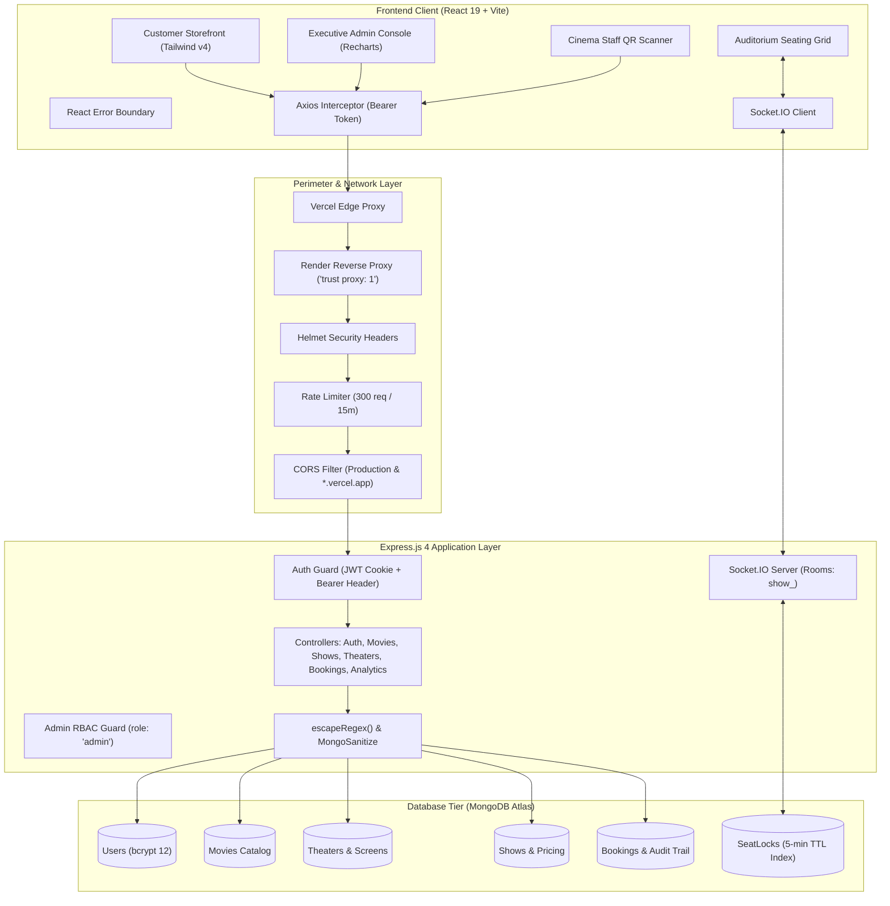

# BookMyShow MERN Clone

> **A full-stack cinema ticket reservation and multiplex operations web application inspired by BookMyShow, built with the MERN stack (MongoDB, Express.js, React 19, Node.js 22 LTS) and Socket.IO.**

This project is an independent academic and portfolio recreation that demonstrates the complete lifecycle of a modern cinema ticketing platform: customer movie discovery, multi-city filtering, real-time interactive seat locking via WebSockets, simulated checkout, cryptographically signed digital QR ticketing, and executive administration with gate admission scanning and business analytics.

> [!NOTE]
> **Payment Simulation Notice:** This project uses a simulated checkout flow for educational and portfolio demonstration. No real monetary transactions are processed, and no real credit card or banking credentials should ever be entered.

---

### Project Status: `v1.0.0 — Production Deployed`
- **Frontend:** [Vercel](https://vercel.com/)
- **Backend:** [Render](https://render.com/)
- **Database:** [MongoDB Atlas](https://www.mongodb.com/atlas)

  If you want to try ADMIN CONSOL

  email-kallatmahadevan@gmail.com
  pass-donny@2006

[](https://nodejs.org/)
[](https://react.dev/)
[](https://tailwindcss.com/)
[](https://expressjs.com/)
[](https://www.mongodb.com/atlas)
[](https://socket.io/)
[](https://vercel.com/)
[](https://render.com/)

---

## 🌐 Live Demo

The application is deployed publicly and ready for interactive evaluation:

- **Frontend Application (Storefront):**  
  [https://book-my-show-clone-gamma-nine.vercel.app](https://book-my-show-clone-gamma-nine.vercel.app)

- **Backend REST API:**  
  [https://bookmyshow-api-57un.onrender.com/api](https://bookmyshow-api-57un.onrender.com/api)

- **API Health Check Endpoint:**  
  [https://bookmyshow-api-57un.onrender.com/api/health](https://bookmyshow-api-57un.onrender.com/api/health)

*(Note: Render free-tier instances may take 30–50 seconds to spin up from a cold sleep on the first request.)*

---


## ✨ Features

### User Authentication & Account Management
- **Registration:** Creates persistent accounts in MongoDB Atlas with client and server-side validation. Public sign-ups are restricted to `role: 'user'` to eliminate privilege escalation.
- **Login:** Authenticates users via email and password using bcrypt comparison.
- **Password Security:** Passwords are hashed using bcrypt with 12 salt rounds before database persistence (`User.js` pre-save hook). Passwords are never returned in queries (`select: false`).
- **Dual Session Architecture:**
  - **HTTP-Only Cookie:** Secure `jwt` cookie with `sameSite: 'none'` and `secure: true` in production.
  - **Bearer Token Authorization:** Authorization header (`Authorization: Bearer <token>`) passed automatically by a centralized Axios interceptor to ensure reliable cross-origin communication between the Vercel frontend and Render backend.
- **Session Persistence:** Application re-validates identity against `GET /api/auth/me` on mount/refresh while hydrating state from non-sensitive local storage tokens.
- **Logout:** Server-side cookie invalidation (`clearTokenCookie`) combined with client-side credential purging.

### Movie Discovery & Theaters
- **Movie Catalog:** Paginated and filtered movie browsing with real-time active status (`isActive`).
- **Rich Movie Details:** Detailed view including film duration, genres, release date, languages, synopsis, and poster/banner media.
- **Multi-City Cinema Filtering:** Filter theaters and available movies across **Bengaluru**, **Chennai**, and **Hyderabad**, with an "All Cities" view.
- **Showtime Selection:** Discover screenings grouped by cinema multiplex, screen number, and format (e.g. IMAX, Dolby Atmos).

### Cinema Booking & Seating
- **Interactive Auditorium Grid:** Visual 10-row by 12-column seating matrix with realistic screen curvature indicators, center cinema aisles, and accessible spaces.
- **Categorized Seating Tiers:**
  - **VIP (Rows A–B):** ₹400 base fare
  - **Premium (Rows C–F):** ₹300 base fare
  - **Regular (Rows G–J):** ₹200 base fare
- **Fare Breakdown:** Automatic computation of ticket subtotal, Convenience Fee (₹30.00), and GST (18% on convenience fee = ₹5.40).
- **Booking Confirmation:** Real-time generation of unique alphanumeric booking reference IDs (e.g., `BMS...`).

### Real-Time Seat Locking
- **Socket.IO Real-Time Engine:** Live WebSocket communication prevents concurrent booking collisions.
- **5-Minute Temporary Lock Window:** When a user selects a seat, it transitions into a temporary held state across all connected clients.
- **MongoDB Persistence:** Temporary locks are stored in the `SeatLock` collection with an automated MongoDB TTL index that cleans up orphaned locks after 5 minutes.
- **WebSocket Event Lifecycle:** Broadcasts `seat-locked`, `seat-unlocked`, and `initial-locks` to room `show_<showId>`.

### Digital QR Ticketing & Gate Scanner
- **Signed Digital QR Ticket:** Encodes booking ID, showtime, and validation tokens into a scannable QR code generated client-side with `qrcode.react`.
- **Downloadable PDF Passes:** Download print-ready cinema e-tickets generated via `jspdf` and `html2canvas`.
- **Gate Entry QR Scanner:** Built-in cinema staff scanner (`/admin/scanner`) that validates digital tickets, marks admissions as `Checked-In`, and immediately blocks duplicate entry attempts (`HTTP 409 Conflict`).

### Operational Admin Console & Executive Analytics
- **Protected Administrator Suite:** Role-based access control (`AdminRoute.jsx`) restricting access to users with `role: 'admin'`.
- **Movie Management:** Complete CRUD interface for movies, metadata, and poster URLs.
- **Theater & Screen Management:** Configure multiplex auditoriums, screen layouts, row capacities, and sound technologies.
- **Conflict-Aware Show Scheduling:** Automated scheduling engine with overlap detection factoring in movie duration, trailer buffers, and cleaning windows.
- **Executive Business Intelligence:** Real-time analytics built with Recharts:
  - Gross & Net Revenue metrics
  - Diurnal Occupancy Heatmap (28-cell matrix across time slots and weekdays)
  - Box Office Movie Performance & Format Benchmarking
  - Ticket Check-In Velocity & Refund Rate tracking

### Multi-City Selection
- Synchronized global state managed by `CityContext` and the `useCity` custom hook.
- Immediate filtering of movie listings and theater showtimes upon changing city in the navbar dropdown.
- Backend queries sanitized using `escapeRegex()` to prevent ReDoS and regex injection.

### Payment Simulation
- "This project uses a simulated payment gateway for demonstration purposes. No real payment is processed."
- Realistic checkout modal (`PaymentModal.jsx`) simulating UPI and Card transactions with multi-stage verification animations.

---

## 🧱 Tech Stack

| Layer | Technology | Version | Purpose |
| :--- | :--- | :---: | :--- |
| **Frontend Framework** | React | `^19.2.8` | Component-driven user interface |
| **Build Tool** | Vite | `^8.3.0` | Ultra-fast development server & production bundler |
| **Styling** | Tailwind CSS | `^4.3.3` | Modern utility-first styling with `@tailwindcss/vite` |
| **Routing** | React Router DOM | `^7.18.4` | Declarative client-side routing & protected guards |
| **HTTP Client** | Axios | `^1.20.0` | Promise-based API requests with Bearer interceptors |
| **Real-Time WebSockets** | Socket.IO Client | `^4.8.4` | Live seat lock synchronization |
| **Data Visualization** | Recharts | `^3.10.1` | Responsive charts for the Admin BI dashboard |
| **Icons** | Lucide React | `^1.48.0` | Modern, clean UI iconography |
| **QR Code Engine** | qrcode.react | `^4.2.0` | SVG/Canvas digital ticket generation |
| **Document Generation** | jsPDF + html2canvas | `^4.2.1` | Client-side print-ready PDF ticket generation |
| **Backend Runtime** | Node.js | `22 LTS` | Server-side JavaScript execution environment |
| **Web Framework** | Express.js | `^4.21.2` | REST API routes, controllers, and middleware |
| **Database Tier** | MongoDB Atlas | `8.0` | Cloud document database with sharded clusters |
| **Database ODM** | Mongoose | `^8.9.5` | Schema validation, compound indexing, `.lean()` queries |
| **WebSocket Server** | Socket.IO | `^4.8.4` | Room-based real-time seat reservation engine |
| **Authentication** | JSON Web Tokens (JWT) | `^9.0.3` | Stateless signed tokens (7-day duration) |
| **Password Hashing** | bcryptjs | `^3.0.3` | One-way password hashing with 12 salt rounds |
| **Security Headers** | Helmet | `^8.3.0` | HTTP headers (HSTS, CSP, XSS protection) |
| **Rate Limiter** | express-rate-limit | `^8.7.0` | Brute-force mitigation (300 requests per 15 min) |
| **Input Sanitization** | express-mongo-sanitize | `^2.2.0` | Automated NoSQL operator injection guard |
| **Static Code Quality** | ESLint + Prettier | `^9.20.0` | Standardized linting and code formatting |
| **Frontend Hosting** | Vercel | Cloud | Global Edge CDN hosting for Single Page App |
| **Backend Hosting** | Render | Cloud | Managed containerized web service hosting |

---

## 🏗️ Architecture



### Architectural Responsibilities
- **Frontend Client:** Handles customer navigation, form validation, global city state (`CityContext`), interactive seat map rendering, simulated payment modals, QR code rendering, and PDF exports.
- **Backend API Layer:** Enforces rate limiting, validates request payloads, handles dual authentication (cookies and Bearer tokens), applies role-based access controls, sanitizes regular expressions against ReDoS, and computes prices.
- **Real-Time Engine:** Socket.IO isolates seat state into showtime-specific rooms (`show_<showId>`) to broadcast seat lock/unlock events instantly with zero database polling.
- **Database Persistence Tier:** MongoDB Atlas stores persistent customer accounts, movies, theaters, showtimes, and confirmed bookings. The `SeatLock` collection leverages a native MongoDB TTL index for automatic lock expiration.

---

## 📁 Project Structure

```
BookMyShow/
├── backend/
│   ├── config/
│   │   └── db.js                        # MongoDB Atlas connection with Mongoose
│   ├── controllers/
│   │   ├── adminController.js           # Admin summary and dashboard stats
│   │   ├── analyticsController.js       # Business intelligence & Recharts data aggregation
│   │   ├── authController.js            # User registration, login, logout, getMe
│   │   ├── bookingAdminController.js    # Operational booking management & refunds
│   │   ├── bookingController.js         # Customer booking creation & My Bookings lookup
│   │   ├── movieAdminController.js      # Admin movie CRUD operations
│   │   ├── movieController.js           # Public movie catalog with .lean() & city filter
│   │   ├── showAdminController.js       # Show scheduling & conflict detection engine
│   │   ├── showController.js            # Public showtime listings & seat availability
│   │   ├── theaterAdminController.js    # Admin theater & screen configuration
│   │   ├── theaterController.js         # Public theater listings & available cities
│   │   └── ticketValidationController.js# Gate entry QR scanner validation logic
│   ├── middleware/
│   │   ├── adminAuth.js                 # Admin-only authorization guard (role: 'admin')
│   │   ├── authMiddleware.js            # Protect middleware supporting Bearer & cookies
│   │   ├── errorHandler.js              # Centralized JSON error response handler
│   │   ├── notFoundHandler.js           # 404 Route Not Found handler
│   │   ├── rateLimiter.js               # Global and auth-specific rate limiting
│   │   └── uploadMovie.js               # Multer disk storage for movie posters
│   ├── models/
│   │   ├── AuditLog.js                  # System operational audit trail
│   │   ├── Booking.js                   # Customer confirmed bookings & scan logs
│   │   ├── Movie.js                     # Movie metadata, posters, languages
│   │   ├── SeatLock.js                  # Temporary seat locks with 5-min TTL index
│   │   ├── Show.js                      # Screenings, tier pricing, seat availability
│   │   ├── Theater.js                   # Cinema locations, screens, layouts
│   │   └── User.js                      # User accounts, bcrypt password hashing
│   ├── routes/
│   │   ├── adminBookingRoutes.js        # Admin booking management routes
│   │   ├── adminMovieRoutes.js          # Admin movie management routes
│   │   ├── adminRoutes.js               # Admin dashboard & stats routes
│   │   ├── adminShowRoutes.js           # Admin show scheduling routes
│   │   ├── adminTheaterRoutes.js        # Admin theater management routes
│   │   ├── analyticsRoutes.js           # Executive BI analytics routes
│   │   ├── auth.js                      # /api/auth/register, /login, /logout, /me
│   │   ├── bookingRoutes.js             # /api/bookings and aliases
│   │   ├── health.js                    # /api/health monitoring endpoint
│   │   ├── index.js                     # Centralized API router registration
│   │   ├── movieRoutes.js               # Public /api/movies routes
│   │   ├── showRoutes.js                # Public /api/shows routes
│   │   ├── theaterRoutes.js             # Public /api/theaters routes
│   │   └── ticketValidationRoutes.js    # Gate scanner QR check-in routes
│   ├── scripts/                         # Verification, migration & benchmark test suites
│   ├── seed/                            # Seed scripts for admin, movies, and theaters
│   ├── socket/
│   │   ├── index.js                     # Socket.IO setup with preview-aware CORS
│   │   └── seatEvents.js                # Seat locking, unlocking, and TTL management
│   ├── app.js                           # Express application configuration
│   ├── server.js                        # HTTP & Socket.IO server startup
│   ├── .env.example                     # Backend environment template
│   └── package.json                     # Backend dependencies and scripts
├── frontend/
│   ├── public/
│   │   ├── favicon.svg                  # Brand favicon
│   │   └── manifest.json                # PWA web application manifest
│   ├── src/
│   │   ├── components/
│   │   │   ├── admin/                   # Admin UI panels, modals, and Recharts
│   │   │   ├── AdminRoute.jsx           # Route guard for administrator pages
│   │   │   ├── CitySelector.jsx         # Multi-city dropdown selector
│   │   │   ├── EmptyState.jsx           # Empty state visual placeholder
│   │   │   ├── ErrorBoundary.jsx        # Root-level React crash recovery boundary
│   │   │   ├── Footer.jsx               # Application footer
│   │   │   ├── HeroBanner.jsx           # Featured movie carousel banner
│   │   │   ├── Loader.jsx               # Cyber-styled loading spinner
│   │   │   ├── MovieCard.jsx            # Movie poster card with hover effects
│   │   │   ├── Navbar.jsx               # Navigation bar with user & city state
│   │   │   ├── PaymentModal.jsx         # Simulated checkout dialog
│   │   │   ├── ProtectedRoute.jsx       # Route guard for authenticated customer pages
│   │   │   ├── QRCodeTicket.jsx         # Authenticated QR code generator
│   │   │   ├── ScreenIndicator.jsx      # Cinema curved screen graphic
│   │   │   ├── SeatGrid.jsx             # Visual 10x12 auditorium seat matrix
│   │   │   ├── SeatLegend.jsx           # Seat category color legend
│   │   │   ├── SeatSummary.jsx          # Selection summary with price calculation
│   │   │   ├── ShowCard.jsx             # Showtime pill card
│   │   │   ├── TheaterCard.jsx          # Theater card grouping showtimes
│   │   │   └── TicketCard.jsx           # Digital ticket pass component
│   │   ├── context/
│   │   │   ├── AuthContext.jsx          # Authentication state & session manager
│   │   │   └── CityContext.jsx          # Global city selection state manager
│   │   ├── hooks/
│   │   │   ├── useAuth.js               # Hook to consume AuthContext
│   │   │   └── useCity.js               # Hook to consume CityContext
│   │   ├── layouts/
│   │   │   ├── AdminLayout.jsx          # Executive admin navigation layout
│   │   │   └── MainLayout.jsx           # Customer storefront navigation layout
│   │   ├── pages/
│   │   │   ├── admin/                   # Admin Dashboard, Movies, Shows, Theaters, etc.
│   │   │   ├── BookingConfirmation.jsx  # Post-payment confirmation with QR ticket
│   │   │   ├── Home.jsx                 # Main movie storefront
│   │   │   ├── LoginPage.jsx            # Customer sign-in page
│   │   │   ├── MovieDetails.jsx         # Movie overview and showtime picker
│   │   │   ├── MyBookings.jsx           # User's booking history
│   │   │   ├── NotFoundPage.jsx         # 404 page
│   │   │   ├── ProfilePage.jsx          # Customer profile summary
│   │   │   ├── RegisterPage.jsx         # Customer sign-up page
│   │   │   └── ShowDetails.jsx          # Auditorium seat map & booking flow
│   │   ├── routes/
│   │   │   └── AppRoutes.jsx            # Centralized application route definitions
│   │   ├── services/
│   │   │   ├── api.js                   # Axios client with Bearer token interceptor
│   │   │   ├── authService.js           # Authentication API calls
│   │   │   ├── bookingService.js        # Booking API calls
│   │   │   ├── movieService.js          # Movie API calls
│   │   │   ├── socket.js                # Socket.IO client instance
│   │   │   └── theaterService.js        # Theater and show API calls
│   │   ├── utils/
│   │   │   ├── constants.js             # API base URL resolver and navigation constants
│   │   │   └── pdfGenerator.js          # Client-side PDF ticket export
│   │   ├── App.jsx                      # App root with providers & ErrorBoundary
│   │   ├── index.css                    # Tailwind CSS configuration
│   │   └── main.jsx                     # Vite DOM entry point
│   ├── .env.example                     # Frontend environment template
│   ├── package.json                     # Frontend dependencies and scripts
│   ├── vercel.json                      # Vercel Single Page App routing configuration
│   └── vite.config.js                   # Vite configuration with chunking & proxy
├── docs/                                # Postman API collections
├── .env.example                         # Root environment variables reference
├── .gitignore                           # Git ignore rules for dependencies and secrets
├── DEPLOYMENT_CHECKLIST.md              # Production release & deployment checklist
└── README.md                            # Project documentation (this document)
```

---

## 🔐 Authentication Flow

The application implements a secure, hybrid session model engineered specifically for modern decoupled cross-origin cloud architectures (Vercel frontend communicating with Render backend):

```
1. Customer inputs credentials on RegisterPage or LoginPage.
2. Request is dispatched to POST /api/auth/register or POST /api/auth/login.
3. Backend validates inputs via express-validator.
4. User record is queried from MongoDB Atlas. For login, bcrypt.compare verifies the hash.
5. Backend signs a 7-day JWT containing { userId } using the server's secret JWT_SECRET.
6. Server issues two credentials:
   a. An HTTP-only cookie named 'jwt' (with sameSite: 'none' and secure: true in production).
   b. The plaintext JWT token in the JSON response body { token: "..." }.
7. Client stores the token string and user profile in localStorage.
8. Centralized Axios Request Interceptor in frontend/src/services/api.js automatically
   attaches the header: Authorization: Bearer <token> to all outgoing requests.
9. Backend auth middleware (authMiddleware.js / adminAuth.js) checks:
   a. Authorization header (Bearer token) FIRST.
   b. Falls back to req.cookies.jwt SECOND.
10. Valid tokens attach the sanitized user document to req.user.
```

### Why Both Cookie and Bearer Authentication?
In cross-origin production environments where the frontend is hosted on Vercel (`*.vercel.app`) and the backend is hosted on Render (`*.onrender.com`), modern browsers often restrict or partition third-party cookies (Strict Privacy Protection / ITP). The centralized Bearer token interceptor guarantees reliable, unbroken authentication across all browsers, while the HTTP-only cookie provides defense-in-depth on same-site or supported browser sessions.

---

## 🗄️ Database Tier (MongoDB Atlas)

All customer accounts, cinema data, and reservations are persisted server-side in MongoDB Atlas:

| Model | Schema File | Description & Purpose |
| :--- | :--- | :--- |
| **User** | [`User.js`](file:///c:/1.Projects/BookMyShow/backend/models/User.js) | Customer and administrator accounts with bcrypt-hashed passwords (12 rounds), roles (`user`, `admin`, `partner`), and timestamps. |
| **Movie** | [`Movie.js`](file:///c:/1.Projects/BookMyShow/backend/models/Movie.js) | Movie catalog information: title, description, duration, genres, release date, poster URL, banner URL, rating, and active status. |
| **Theater** | [`Theater.js`](file:///c:/1.Projects/BookMyShow/backend/models/Theater.js) | Multiplex entities: name, city, address, screen configurations, seat rows, and supported sound formats (IMAX, Dolby Atmos). |
| **Show** | [`Show.js`](file:///c:/1.Projects/BookMyShow/backend/models/Show.js) | Scheduled screenings: references to Movie and Theater, screen number, showtime intervals, tier pricing, and seat statuses. |
| **Booking** | [`Booking.js`](file:///c:/1.Projects/BookMyShow/backend/models/Booking.js) | Confirmed reservations: references to user/show/movie/theater, seat list, subtotal, convenience fee, GST, total amount, booking ID, QR token, and audit history. |
| **SeatLock** | [`SeatLock.js`](file:///c:/1.Projects/BookMyShow/backend/models/SeatLock.js) | Temporary seat locks held during booking, backed by an automated 5-minute MongoDB TTL index on `expiresAt`. |
| **AuditLog** | [`AuditLog.js`](file:///c:/1.Projects/BookMyShow/backend/models/AuditLog.js) | System-level event trail recording administrative actions, refunds, show creation, and gate check-ins. |

---

## ⚙️ Installation & Local Development

### Prerequisites
Before running the application locally, ensure you have installed:
- **Node.js:** `v20.x` or `v22.x LTS` (tested on Node.js v22.14.0)
- **npm:** `v10.x` or higher
- **MongoDB:** A free [MongoDB Atlas Cluster](https://www.mongodb.com/atlas) connection URI or a local MongoDB instance running on `mongodb://localhost:27017`
- **Git**

---

### Step 1: Clone the Repository
```bash
git clone https://github.com/mrfrosty7007/BookMyShow-Clone.git
cd BookMyShow-Clone
```

---

### Step 2: Configure Environment Variables

Create `.env` inside the `backend/` directory:
```bash
# Inside backend/.env
PORT=5000
NODE_ENV=development
MONGODB_URI=mongodb+srv://<username>:<password>@cluster.xxxxx.mongodb.net/bookmyshow_clone?retryWrites=true&w=majority
JWT_SECRET=your_development_jwt_secret_key_at_least_32_characters
CLIENT_URL=http://localhost:5173
```

*(Optional)* Create `.env` inside the `frontend/` directory (defaults work automatically for local development via the Vite proxy):
```bash
# Inside frontend/.env
VITE_API_URL=/api
VITE_DEV_BACKEND_URL=http://localhost:5000
```

---

### Step 3: Install Dependencies

```bash
# Install backend dependencies
cd backend
npm install

# Install frontend dependencies
cd ../frontend
npm install
cd ..
```

---

### Step 4: Seed Database with Sample Catalog & Admin Account

From the `backend/` directory, seed default administrators, movies, and theaters:

```bash
cd backend

# 1. Provision default administrator account
npm run seed:admin

# 2. Seed movies, theaters, screens, and scheduled showtimes
npm run seed

cd ..
```

> **Default Seed Administrator Credentials:**  
> **Email:** `admin@bookmyshow.com`  
> **Password:** `AdminPassword123!`

---

## ▶️ Running Locally

Launch the backend and frontend in two separate terminal windows:

### Terminal 1: Backend API & WebSockets
```bash
cd backend
npm run dev
```
*Server starts on `http://localhost:5000` with nodemon auto-reload.*

### Terminal 2: Frontend Client
```bash
cd frontend
npm run dev
```
*Vite development server starts on `http://localhost:5173`.*

### Local Application URLs
- **Customer Storefront:** [http://localhost:5173](http://localhost:5173)
- **Admin Executive Console:** [http://localhost:5173/admin/login](http://localhost:5173/admin/login)
- **Backend REST API:** [http://localhost:5000/api](http://localhost:5000/api)
- **API Health Check:** [http://localhost:5000/api/health](http://localhost:5000/api/health)

---

## 🧪 Testing & Validation

The repository includes dedicated verification scripts, performance benchmarks, and linting suites located under `backend/scripts/`:

```bash
# 1. Verify Authentication & Bearer Token Flow (8/8 Checks)
node backend/scripts/verify-auth-fix.js

# 2. Verify Multi-City Catalog Filtering (6/6 Checks)
cd backend && node scripts/verify-city-filter.js && cd ..

# 3. Verify Registration Privilege Escalation & Admin RBAC (3/3 Checks)
cd backend && node scripts/verify-auth-security.js && cd ..

# 4. Verify ReDoS & Regular Expression Input Sanitization (10/10 Checks)
cd backend && node scripts/verify-regex-security.js && cd ..

# 5. Verify Socket.IO CORS & Vercel Preview Deployments (6/6 Checks)
cd backend && node scripts/verify-socket-cors.js && cd ..

# 6. Run Code Linter on Backend & Frontend
cd backend && npm run lint
cd ../frontend && npm run lint

# 7. Validate Production Bundle Compilation
cd ../frontend && npm run build
```

### Audited Verification Results
- **Authentication Flow:** 8 / 8 checks passed (Registration, login, cookie issuance, Bearer authorization, profile query, unauthenticated rejection).
- **Multi-City Filtering:** 6 / 6 checks passed (Bengaluru, Chennai, Hyderabad, case-insensitivity, unknown city handling).
- **Registration Security:** Privilege escalation eliminated; public registration is immutably assigned `role: 'user'`.
- **Query Sanitization:** 10 / 10 tests passed against ReDoS wildcards (`.*`, `(`, `+`, `|`, `[abc]`).
- **Socket.IO CORS:** 6 / 6 origin checks passed for production domains and `*.vercel.app` preview environments.
- **Frontend & Backend Linters:** 0 errors, 0 warnings across the entire repository.
- **Production Build:** Succeeded in 1.01s with zero broken imports.
- **End-to-End User Journey Smoke Test:** 9 / 9 steps passed (Register ➔ Login ➔ Refresh ➔ Browse ➔ City Filter ➔ Book ➔ Payment ➔ My Bookings ➔ Logout).

---

## 🚀 Deployment

The system is deployed on modern cloud infrastructure with zero server maintenance requirements:

```
[Customer Browser]
       │
       ▼
 [Vercel CDN]  ───(HTTPS / SPA Client)───►  https://book-my-show-clone-gamma-nine.vercel.app
       │
       ▼ (REST API / Bearer Token)
 [Render Web Service]  ───►  https://bookmyshow-api-57un.onrender.com/api
       │
       ▼ (TLS 1.3 Mongoose Connection)
 [MongoDB Atlas Cluster]  ───►  AWS Sharded Cluster (bookmyshow_clone)
```

### Production Environment Variables

#### Render (Backend Web Service)
| Variable | Value / Format | Purpose |
| :--- | :--- | :--- |
| `NODE_ENV` | `production` | Enables production optimizations, secure cookies, and strict logging |
| `PORT` | `5000` (or dynamically assigned) | HTTP & Socket.IO server port |
| `MONGODB_URI` | `mongodb+srv://...` | MongoDB Atlas TLS connection string |
| `JWT_SECRET` | 32+ character random string | Signs session tokens and cookies |
| `CLIENT_URL` | `https://book-my-show-clone-gamma-nine.vercel.app` | Production frontend domain for strict CORS credentials exchange |

#### Vercel (Frontend Project)
| Variable | Value | Purpose |
| :--- | :--- | :--- |
| `VITE_API_URL` | `https://bookmyshow-api-57un.onrender.com/api` | Base URL used by Axios to query backend REST endpoints |

---

## 🔒 Security & Hardening Measures

- **Password Hashing:** Uses `bcryptjs` with 12 salt rounds. Plaintext passwords are never saved or exposed.
- **JWT Authentication:** Cryptographically signed tokens with a 7-day expiration lifespan.
- **Cross-Origin Cookie Protection:** Cookies set with `httpOnly: true`, `secure: true`, and `sameSite: 'none'` in production.
- **NoSQL Injection Guard:** `express-mongo-sanitize` strips `$` and `.` operators from client request payloads.
- **ReDoS Prevention:** Dynamic regex inputs in city and search filters are sanitized with `escapeRegex()` to neutralize regular expression denial of service attacks.
- **Rate Limiting:** `express-rate-limit` throttles IP requests to 300 requests per 15-minute window with proxy trust enabled (`app.set("trust proxy", 1)`).
- **HTTP Security Headers:** `helmet` sets strict transport security (HSTS), cross-origin resource policy, and frame protection.
- **Privilege Protection:** Public registrations are hardcoded to `role: 'user'`. Administrative accounts can only be provisioned through protected CLI scripts or database administrator access.
- **Secrets Management:** Zero secrets or credentials committed to source control. All sensitive keys are loaded via environment variables and excluded by [`.gitignore`](file:///c:/1.Projects/BookMyShow/.gitignore).

---

## 💳 Payment Disclaimer

### Simulated Payment Checkout
This project contains a **simulated checkout experience** built purely for technical and educational demonstration:
- No real monetary transactions are processed.
- No real debit card, credit card, UPI PIN, or banking credentials should ever be entered into the modal.
- The checkout modal displays an educational simulation banner and processes dummy card and UPI inputs using local state timeouts.
- Real payment gateway integration (e.g. Razorpay or Stripe) is considered an optional post-submission enhancement.

---

## 👨‍💻 User Roles & Permissions

| Role | Access Level | Available Capabilities |
| :--- | :--- | :--- |
| **Guest / Public** | Storefront | Browse active movie catalog, view movie details, inspect showtimes, filter by city, access login/registration pages. |
| **Authenticated Customer** (`role: 'user'`) | Storefront + Account | Lock seats in real time (5 minutes), complete simulated booking, access "My Bookings", view signed QR tickets, download PDF ticket passes. |
| **Administrator** (`role: 'admin'`) | Full System | Access `/admin` portal, create/edit/delete movies, configure multiplex screens and seat layouts, schedule showtimes with conflict detection, scan gate tickets with duplicate check, view executive analytics. |

---

## 🧑‍🏫 Academic Submission Details

This project was built as a comprehensive **Second-Year Web Application Recreation Project** demonstrating full-stack engineering proficiency across the MERN stack.

### Assignment Rubric Compliance Checklist
- [x] **Popular Website Recreated:** BookMyShow cinema ticketing platform.
- [x] **Required Core Pages:** Landing/Home page (`/`), Registration page (`/register`), Login page (`/login`).
- [x] **Fully Working Backend:** Express 4.x REST API with Socket.IO real-time capabilities.
- [x] **Real User Registration & Login:** Persistent user accounts with bcrypt 12-round hashing.
- [x] **Server-Side Session Handling:** JWT validation via cookies and Authorization Bearer headers.
- [x] **Session Persistence:** State restored and validated on page reload.
- [x] **Secure Logout:** Token cookies cleared and client storage purged.
- [x] **Database Persistence:** MongoDB Atlas cluster stores all accounts, movies, theaters, shows, and bookings.
- [x] **No LocalStorage Auth Dependency:** All authentication verified server-side against database; `localStorage` is used solely as a convenience cache.
- [x] **Additional Working Features:** Real-time temporary seat locking, interactive seating grid, simulated payment, scannable QR tickets, PDF passes, multi-city filtering, and executive administrative console.
- [x] **Public Deployment:** Live frontend on Vercel and live backend on Render.
- [x] **Code Quality:** Zero ESLint errors or warnings, passing Vite production build, zero hardcoded secrets.

---

## 🗺️ Future Improvements

The following items are optional post-submission enhancements:
- **Third-Party OAuth:** Social sign-in options (e.g. Google OAuth 2.0).
- **Email Verification:** Account activation links and transactional ticket emails via SendGrid / Resend.
- **Real Payment Gateways:** Stripe or Razorpay webhook integration for actual monetary transactions.
- **Web Push Notifications:** Native browser Service Worker notifications reminding users of upcoming showtimes.
- **Offline PWA Ticket Wallet:** Service Worker caching allowing customers to view booked QR passes without an active internet connection.

---

## 📄 License

This is an independent academic and portfolio project. No explicit open-source license has been added to this repository; all rights are reserved by the author for academic review and portfolio demonstration.

---

## 🙏 Acknowledgements

- **Inspiration:** Inspired by the user experience, architecture, and aesthetics of [BookMyShow](https://in.bookmyshow.com/).
- **Disclaimer:** This project is an independent educational clone and is not affiliated with, endorsed by, or in any way officially connected with BookMyShow or Bigtree Entertainment Pvt. Ltd. All movie trademarks, poster artwork, and brand references belong to their respective copyright holders.
