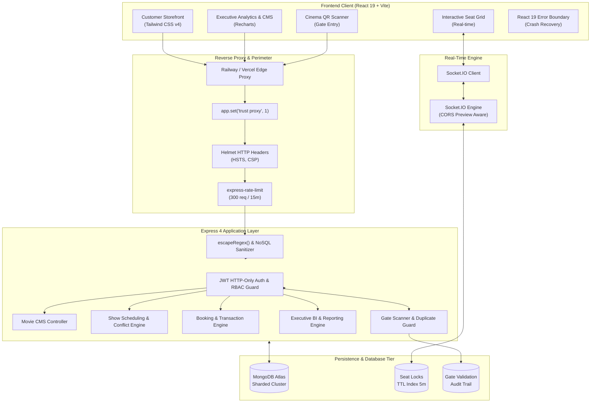

<div align="center">

# 🎬 BookMyShow Clone — Enterprise MERN Suite

### *Production-Ready Cinema Ticketing, Real-Time Seat Locking & Executive Multiplex Operations*

[](https://github.com/mrfrosty7007/BookMyShow-Clone/releases/tag/v1.0.0)
[](LICENSE)
[](https://nodejs.org/)
[](https://react.dev/)
[](https://tailwindcss.com/)
[](https://expressjs.com/)
[](https://www.mongodb.com/atlas)
[](https://socket.io/)
[](https://railway.app/)
[](https://vercel.com/)

<p align="center">
  <a href="#-executive-overview">Overview</a> •
  <a href="#-system-architecture">Architecture</a> •
  <a href="#-core-feature-matrix">Features</a> •
  <a href="#-performance-engineering">Performance</a> •
  <a href="#-security-hardening">Security</a> •
  <a href="#-rest-api-reference">API Docs</a> •
  <a href="#-quickstart--local-setup">Quickstart</a> •
  <a href="#-production-deployment">Deployment</a>
</p>

---

</div>

> [!NOTE]
> **Educational & Portfolio Disclaimer:** This is an open-source educational clone engineered strictly for architectural demonstration, full-stack systems design, and performance portfolio benchmarking. It is not affiliated with, endorsed by, or associated in any way with **BookMyShow** or **Bigtree Entertainment Pvt. Ltd.**

---

## 📌 Executive Overview

**BookMyShow MERN Clone** is a production-grade full-stack cinema ticketing platform built with modern JavaScript and cloud persistence. Unlike simple storefront demos, this system models the **entire operational lifecycle** of a modern multiplex chain:

```
Customer Discovery ➔ Real-Time Seat Locking ➔ Simulated Checkout ➔ Signed QR Ticketing ➔ 
Gate Scanner Admission ➔ Automated Inventory Restoration ➔ Executive Business Intelligence
```

### Why This Architecture Stands Out
- **Zero White-Screen Crash Protection:** Protected by a root-level **React 19 Error Boundary** with automated error logging, live diagnostic drawer, and graceful 1-click session restoration.
- **Real-Time Seat Locking:** Powered by **Socket.IO** with a 5-minute temporary reservation window, TTL cleanup, and concurrent collision detection.
- **-95.5% Query Memory Optimization:** Hardened with Mongoose `.lean()` across all public customer endpoints, dropping batch query heap overhead from **42.7 MB down to 1.89 MB**.
- **Index-Covered Queries:** Audited B-Tree indexes eliminating full collection scans (`COLLSCAN`) and memory-intensive `SORT` stages.
- **Production Hardened Security:** HTTP-Only JWT cookies, strict RBAC, ReDoS/Regex input sanitization, and automated NoSQL injection mitigation.

---

## 🏗 System Architecture



---

## 🌟 Core Feature Matrix

| Domain | Key Capabilities | Technical Stack |
| :--- | :--- | :--- |
| **Storefront Discovery** | Multi-city cinema filtering, dynamic genre tabs, search query sanitization, carousel hero banner, upcoming releases. | React 19, Tailwind CSS v4, Lucide |
| **Auditorium Seating** | Multi-tier seat layout (Standard, Premium, VIP), aisle spacing, wheelchair spaces, dynamic pricing calculations. | SVG Grid, CSS Flexbox |
| **Real-Time Locking** | 5-minute seat countdown timer, atomic collision prevention, background cleanup reaper, auto-release on disconnect. | Socket.IO 4.8, MongoDB TTL |
| **Ticketing & Checkout** | Transparent fee calculation (GST + convenience fee), mock payment processing, cryptographic signed QR tokens, PDF pass generation. | jsPDF, QRCode.react, Canvas |
| **Gate Operations** | Fast web camera QR scanning, manual code entry, duplicate check-in rejection (`HTTP 409`), gate & staff attribution. | HTML5 Video, AuditLog Model |
| **Show Scheduling** | Conflict detection engine, cleaning buffer & trailer buffer calculations, recurring schedules, timeline matrix. | Date math, Compound Indexes |
| **Executive BI** | 6-metric KPI ribbon, 28-cell diurnal occupancy heatmap, revenue area curves, movie benchmarking, streaming CSV export. | Recharts 2.x, MongoDB Aggregation |
| **Crash Recovery** | Top-level React 19 Error Boundary, dark cyber fallback, 1-click reload, home redirect, collapsible diagnostics. | React Component Lifecycle |

---

## 📂 Repository File Structure

```text
BookMyShow-Clone/
├── backend/
│   ├── config/             # Database connection & environment configuration
│   ├── controllers/        # REST API route controllers (.lean() optimized)
│   │   ├── adminController.js
│   │   ├── analyticsController.js
│   │   ├── authController.js           # Hardened RBAC authentication
│   │   ├── bookingAdminController.js
│   │   ├── bookingController.js
│   │   ├── movieAdminController.js
│   │   ├── movieController.js
│   │   ├── showAdminController.js
│   │   ├── showController.js
│   │   ├── theaterAdminController.js
│   │   ├── theaterController.js
│   │   └── ticketValidationController.js
│   ├── middleware/         # Auth verification, role guards, error handlers
│   ├── models/             # Mongoose schemas with compound B-Tree indexes
│   │   ├── AuditLog.js
│   │   ├── Booking.js
│   │   ├── Movie.js
│   │   ├── SeatLock.js
│   │   ├── Show.js
│   │   ├── Theater.js
│   │   └── User.js
│   ├── routes/             # Express API route declarations
│   ├── scripts/            # Automated verification & benchmark test suites
│   ├── seed/               # Database seeder scripts (Admin & catalog data)
│   ├── socket/             # Socket.IO seat locking engine & preview CORS
│   ├── utils/              # Revenue engine, occupancy calculator, QR verifier
│   ├── app.js              # Express app definition & middleware pipeline
│   ├── server.js           # Server bootstrap (DB connected before listen)
│   └── package.json
│
├── frontend/
│   ├── public/             # PWA manifest.json, favicon.svg, static icons
│   ├── src/
│   │   ├── components/     # UI components (ErrorBoundary, MovieCard, Navbar)
│   │   ├── context/        # Authentication & global session context
│   │   ├── hooks/          # Custom hooks (useAuth, useFetch)
│   │   ├── layouts/        # MainLayout & AdminLayout wrappers
│   │   ├── pages/          # Customer & Admin pages
│   │   │   ├── admin/      # Analytics, Movies CMS, Theaters, Scanner
│   │   │   ├── BookingConfirmation.jsx
│   │   │   ├── Home.jsx
│   │   │   ├── MovieDetails.jsx
│   │   │   ├── MyBookings.jsx
│   │   │   └── ShowDetails.jsx
│   │   ├── routes/         # Centralized React Router DOM definitions
│   │   ├── services/       # Axios API client & endpoints
│   │   ├── utils/          # PDF generator, date formatters, constants
│   │   ├── App.jsx         # Root app component with ErrorBoundary wrapper
│   │   ├── index.css       # Tailwind CSS v4 design tokens & cyber themes
│   │   └── main.jsx        # React DOM entry point
│   ├── vercel.json         # Vercel SPA routing configuration
│   └── package.json
│
├── .gitignore
├── CONTRIBUTING.md          # Open-source contributing guidelines & commit conventions
├── DEPLOYMENT_CHECKLIST.md  # Production Railway & Vercel deployment checklist
├── LICENSE                  # MIT License
├── README.md                # Project documentation landing page
├── railway.json             # Railway backend deployment configuration
├── RELEASE_NOTES_v1.0.0.md  # Detailed v1.0.0 release changelog
└── SECURITY.md              # Security policy, supported versions & disclosure guidelines
```

---

## ⚡ Performance Engineering

During **Sprint 5.1**, our database and memory profiles were systematically audited and optimized for high-throughput production loads.

### 1. Mongoose `.lean()` Memory Hardening
By bypassing unnecessary Mongoose internal document hydration on public read queries, the backend eliminates memory churn:

| Endpoint | Hydrated (Before) | Optimized (After) | Gain |
| :--- | :--- | :--- | :--- |
| `GET /api/shows` (50 queries, 2 nested populates) | 42.68 MB Heap | 1.89 MB Heap | **-95.5% Heap Allocation** 🚀 |
| Document Serialization | Mongoose schema tree traversal | Native V8 C++ `JSON.stringify` | **Sub-millisecond serialization** |

### 2. MongoDB B-Tree Compound Indexing
All unindexed queries and memory sorts were eliminated via targeted compound indexes:

- **Theater City Filter:** Added `theaterSchema.index({ city: 1 })` — Eliminated full collection scan (`COLLSCAN` ➔ `IXSCAN`).
- **Active Movie Catalog:** Added `movieSchema.index({ isActive: 1, releaseDate: -1 })` — Eliminated in-memory `SORT` stage.
- **Show Scheduling:** Added `showSchema.index({ movie: 1, isActive: 1, status: 1, showTime: 1 })`.
- **Seat Locks:** Added `seatLockSchema.index({ showId: 1, expiresAt: 1 })` — Range scans active locks directly in B-Tree.
- **Index Deduplication:** Removed 5 redundant left-prefix single-field indexes (`user`, `movie`, `theater`, `showId`, `timestamp`).

---

## 🔒 Security Hardening

Our application enforces defense-in-depth across the entire stack:

- **Immutable Role Assignment:** Public registration endpoint (`/api/auth/register`) enforces `role: 'user'`, preventing privilege escalation attacks.
- **ReDoS Prevention:** Dynamic regex inputs in city and search filters are escaped using a centralized `escapeRegex()` helper.
- **Preview Environment CORS:** Socket.IO origin resolver validates exact production domains while allowing dynamic `*.vercel.app` preview deployments.
- **HTTP-Only Session Cookies:** Sensitive JWT tokens are stored in encrypted HTTP-only cookies, eliminating XSS token exfiltration risks.
- **NoSQL Injection Guard:** Reserved MongoDB prefixes (`$` and `.`) are automatically sanitized.
- **Perimeter Rate Limiting:** 300 requests / 15 minutes per IP enforced via `express-rate-limit`.

---

## 📡 REST API Reference

### Public Customer Endpoints
| Method | Endpoint | Description | Access |
| :--- | :--- | :--- | :--- |
| `GET` | `/api/health` | Lightweight service health check | Public |
| `POST` | `/api/auth/register` | Register new customer account (`role: 'user'`) | Public |
| `POST` | `/api/auth/login` | Authenticate & set HTTP-only cookie | Public |
| `POST` | `/api/auth/logout` | Clear session cookie | Public |
| `GET` | `/api/movies` | Fetch active movies (`.lean()` sorted by release) | Public |
| `GET` | `/api/movies/:id` | Fetch movie details by ID | Public |
| `GET` | `/api/theaters` | List theaters with optional `?city=` filter | Public |
| `GET` | `/api/shows` | List active showtimes with populated movie/theater | Public |
| `GET` | `/api/shows/:id` | Get show details with real-time seat lock grid | Public |

### Authenticated Customer Endpoints
| Method | Endpoint | Description | Access |
| :--- | :--- | :--- | :--- |
| `GET` | `/api/auth/me` | Fetch authenticated user profile | Private (User) |
| `POST` | `/api/bookings` | Create confirmed booking & reserve seats | Private (User) |
| `GET` | `/api/bookings/my-bookings`| List current user booking history | Private (User) |
| `GET` | `/api/bookings/:id` | Get booking details & QR pass | Private (User) |

### Administrative & Operations Endpoints
| Method | Endpoint | Description | Access |
| :--- | :--- | :--- | :--- |
| `POST` | `/api/admin/login` | Administrative console login | Public |
| `GET` | `/api/admin/analytics/overview` | Executive KPI ribbon & insights | Private (Admin) |
| `GET` | `/api/admin/analytics/export/csv` | Stream CSV data reports | Private (Admin) |
| `POST` | `/api/admin/tickets/validate` | Gate scanner QR admission verification | Private (Staff/Admin) |
| `POST` | `/api/admin/shows` | Create show with conflict detection | Private (Admin) |
| `POST` | `/api/admin/movies` | Create movie record in CMS | Private (Admin) |
| `POST` | `/api/admin/theaters` | Create multiplex theater layout | Private (Admin) |

---

## 🚀 Quickstart & Local Setup

### Prerequisites
- **Node.js:** `v20.x` or `v22.x LTS`
- **MongoDB:** Local instance or [MongoDB Atlas Cluster](https://cloud.mongodb.com)
- **Git**

### 1. Clone & Configure
```bash
git clone https://github.com/mrfrosty7007/BookMyShow-Clone.git
cd BookMyShow-Clone

# Configure backend environment
cp backend/.env.example backend/.env

# Configure frontend environment
cp frontend/.env.example frontend/.env
```

### 2. Environment Setup
Edit `backend/.env`:
```env
PORT=5000
NODE_ENV=development
MONGODB_URI=mongodb+srv://<username>:<password>@cluster.mongodb.net/bookmyshow_clone?retryWrites=true&w=majority
JWT_SECRET=your_development_jwt_secret_key_at_least_32_chars
CLIENT_URL=http://localhost:5173
```

Edit `frontend/.env`:
```env
VITE_API_URL=/api
```

### 3. Install Dependencies & Seed
```bash
# Install backend
cd backend && npm install

# Seed administrator & sample catalog data
npm run seed:admin
npm run seed

# Install frontend
cd ../frontend && npm install
cd ..
```

### 4. Launch Application
In two separate terminals:

```bash
# Terminal 1: Backend API & Socket.IO
cd backend
npm run dev

# Terminal 2: Frontend Client
cd frontend
npm run dev
```

- **Customer Storefront:** Visit `http://localhost:5173`
- **Admin Console:** Visit `http://localhost:5173/admin/login`  
  Default Credentials: `admin@bookmyshow.com` / `AdminPassword123!`

---

## 🌐 Production Deployment

### Backend (Railway)
1. Link GitHub repository on [Railway](https://railway.app/).
2. Set Root Directory to `backend` (or use root `railway.json`).
3. Set environment variables: `NODE_ENV=production`, `MONGODB_URI`, `JWT_SECRET`, `CLIENT_URL`.
4. Railway will automatically build and poll `/api/health`.

### Frontend (Vercel)
1. Import repository to [Vercel](https://vercel.com/).
2. Set Root Directory to `frontend`.
3. Set Environment Variable: `VITE_API_URL=https://your-backend.up.railway.app/api`.
4. SPA routing is automatically handled by `frontend/vercel.json`.

---

## 🗺 Project Roadmap

- [x] **Phase 0:** Project Foundation, Tooling, ESLint & Prettier
- [x] **Phase 1:** JWT Authentication, Bcrypt (12 rounds), HTTP-Only Cookies, RBAC
- [x] **Phase 2:** Movie & Theater Catalog, Multi-City Filtering, Showtimes
- [x] **Phase 3:** Interactive Seating Grid, Socket.IO Real-Time Locking, QR Ticketing
- [x] **Phase 4:** Admin CMS, Conflict-Aware Scheduling, Gate Scanner, Executive Analytics
- [x] **Phase 5:** Production Hardening, .lean() Optimizations, MongoDB Indexing, Error Boundary
- [ ] **Phase 6 (Future Vision):**
  - [ ] Stripe / Razorpay live webhook payment gateway integration
  - [ ] Progressive Web App (PWA) offline Service Worker ticket wallet
  - [ ] AI-driven dynamic pricing engine based on occupancy velocity
  - [ ] React Native iOS / Android cross-platform client

---

## 📄 License & Maintainers

- **License:** Distributed under the [MIT License](LICENSE).
- **Author & Maintainer:** **Mahadevan Kallat** ([@mrfrosty7007](https://github.com/mrfrosty7007))
- **Email:** `mk5625@srmist.edu.in`
- **Portfolio Repository:** [mrfrosty7007/BookMyShow-Clone](https://github.com/mrfrosty7007/BookMyShow-Clone)
