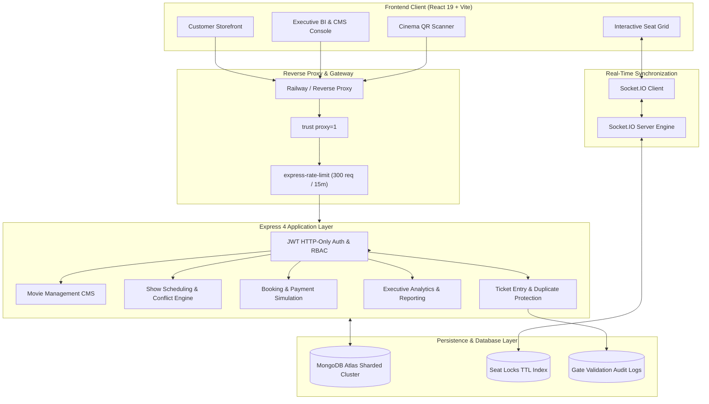

# BookMyShow Clone — Production MERN Stack Suite (v1.0.0)

[](https://opensource.org/licenses/MIT)
[](https://nodejs.org/)
[](https://react.dev/)
[](https://tailwindcss.com/)
[](https://expressjs.com/)
[](https://mongoosejs.com/)
[](https://socket.io/)
[](https://railway.app/)
[](https://vercel.com/)

> **Disclaimer:** This is an educational clone developed strictly for portfolio demonstration and software architecture learning purposes. It is not affiliated with, endorsed by, or associated in any way with **BookMyShow** or **Bigtree Entertainment Pvt. Ltd.**

---

## 📌 Executive Overview

**BookMyShow-Clone** is an enterprise-grade full-stack cinema ticketing platform built with the **MERN** stack (MongoDB, Express, React, Node.js). Spanning from public storefront movie discovery to real-time seat locking, dynamic QR ticketing, cinema entrance scanner kiosks, multiplex screen design builders, conflict-free scheduling engines, and executive business intelligence dashboards, this platform models the end-to-end operational lifecycle of modern cinema chains.

---

## 🏗 Architecture Overview



---

## 🌟 Core Features Catalog

### 1. 🔐 Authentication & Session Security (Phase 1 & 1.5)
- **HTTP-Only JWT Cookies**: Neutralizes XSS token theft by storing access tokens in encrypted HTTP-only, `sameSite: 'lax'`, secure cookies.
- **Bcrypt Password Encryption**: 12 salt rounds for strong credential hashing.
- **Role-Based Access Control (RBAC)**: Distinct permissions for `customer`, `staff`, and `admin` roles with custom route guards.
- **NoSQL Query Sanitization**: Automatic sanitization stripping `$` and `.` operators via `express-mongo-sanitize`.
- **Brute-Force Protection**: Dedicated 5-attempt rate limiters on login endpoints.

### 2. 🎬 Movie & Theater Catalog (Phase 2 & 2.7)
- **Multi-City Support**: Filter showtimes and multiplexes across major metropolitan regions (Mumbai, Delhi-NCR, Bengaluru, Hyderabad, Chennai, Kolkata).
- **Format Tagging**: Support for Standard 2D/3D, IMAX 3D, Dolby Atmos, Gold Class, and 4DX.
- **Dynamic Show Listings**: Aggregated showtime chips categorized by morning, matinee, evening, and night windows with real-time availability counters.

### 3. 💺 Interactive Seat Selection & Real-Time Locking (Phase 3.1 & 3.2)
- **Multi-Tier Seating Grids**: VIP, Premium, and Executive tiers with dynamic pricing, accessibility spaces, and realistic cinema aisles.
- **Real-Time Seat Locking via Socket.IO**:
  - Temporary 5-minute seat reservation timer with countdown feedback.
  - Automatic collision prevention across concurrent user sessions.
  - Automatic seat unlock upon tab closure, explicit deselect, or timer expiration.
  - Seamless promotion from locked status to permanent booking upon successful checkout.

### 4. 💳 Checkout, Simulated Payments & QR Tickets (Phase 3.3)
- **Integrated Checkout Drawer**: Transparent fee breakdowns detailing base fare, convenience charges, and GST.
- **Mock Payment Gateway**: Interactive simulated credit card and UPI payment processing animations.
- **Cryptographic QR Pass Generation**: Tamper-proof signed payload embedded in scannable QR ticket barcodes.
- **PDF & Digital Pass Generation**: One-click printable PDF tickets and mobile pass downloads.
- **Customer "My Bookings" Portal**: Full booking history with live countdown to showtime, status tracking, and self-service cancellation.

### 5. 🛠 Administrative CMS & Operations (Phase 4.1 – 4.5)
- **Movie Management System**: Create, update, soft-delete, restore, and feature movies with image upload support.
- **Visual Multiplex & Seat Builder**: Design auditorium layouts visually with row configurations, custom aisles, and format assignment.
- **Conflict-Aware Show Scheduling Engine**: Automated show overlap detection factoring in film duration, interval cleaning buffers, and maintenance slots.
- **QR Ticket Entrance Scanner**: Web-based camera and manual barcode scanner for cinema staff at gates, featuring duplicate entry detection (HTTP 409) and session validation.
- **Refund Tier Automation Engine**: Multi-tiered refund calculation (100% for >24h, 75% for 6–24h, 50% for 1–6h) with automated inventory seat restoration.
- **Seat Lock Recovery Daemon**: Background recovery engine automatically reclaiming orphaned seats.

### 6. 📊 Executive Analytics & Business Intelligence Suite (Phase 4.6)
- **Executive KPI Ribbon**: Total gross revenue, net revenue, tickets sold, average ticket price (ATP), refund rate, and admission check-in percentage with growth velocity delta badges.
- **7D × 4 Diurnal Slots Occupancy Heatmap**: 28-cell matrix mapping congestion density across Monday–Sunday and Morning, Matinee, Evening, and Night windows.
- **Revenue Intelligence Curves**: Recharts AreaChart with smooth monotone curves and Daily, Weekly, and Monthly resolution toggles.
- **Movie Performance Ranking**: Composed dual-axis chart benchmarking Top 10 box office grossers against auditorium occupancy rates.
- **Theater Format Utilization**: Capacity and revenue efficiency comparisons across IMAX, Dolby Atmos, and Standard screens.
- **Automated Heuristic Insights Engine**: Real-time synthesized observations identifying peak drivers, format performance deltas, and operational health.
- **Multi-Format Report Export System**: One-click generation and streaming download of executive CSV reports and printable PDF executive briefs.

### 7. 🛡 Production Hardening & Resilience (Phase 5)
- **Reverse Proxy Trust**: `app.set("trust proxy", 1)` for accurate client IP identification behind Railway, Render, and Vercel.
- **Global API Rate Limiting**: 300 requests / 15 minutes per IP in production (1000 in development), with `/api/health` bypassed for monitoring.
- **Deployment Health Monitoring**: Lightweight `GET /api/health` reporting service status, environment, uptime, and timestamp with zero DB mutations.
- **Graceful Process Shutdown**: Orderly cleanup closing HTTP server first, then terminating MongoDB Atlas connection on `SIGINT` / `SIGTERM`.
- **Production Environment Validation**: Startup fails fast with diagnostic output if `MONGODB_URI`, `JWT_SECRET`, or `CLIENT_URL` are missing in production.

---

## 💻 Tech Stack Specification

| Category | Technology | Purpose |
|:---------|:-----------|:--------|
| **Frontend Framework** | React 19 + Vite | High-performance Single Page Application (SPA) with ES Modules |
| **Styling & Theme** | Tailwind CSS v4 | Cyberpunk dark-mode executive UI design system |
| **Routing** | React Router DOM v7 | Declarative routing with protected Admin and Customer layouts |
| **Visualizations** | Recharts 2.x | Area, Bar, Line, Heatmap, and Composed charts |
| **Icons** | Lucide React | Clean, tree-shakeable SVG icons |
| **Backend Runtime** | Node.js 22 LTS | Standardized JavaScript runtime (ESM) |
| **API Framework** | Express 4.x | Modular RESTful API architecture |
| **Database** | MongoDB Atlas | Cloud-hosted sharded document persistence via Mongoose 8 |
| **Real-Time Engine** | Socket.IO 4.8 | Bidirectional seat reservation and live availability syncing |
| **Security Suite** | Helmet, express-rate-limit, express-mongo-sanitize, cookieParser, bcryptjs, jsonwebtoken | HTTP headers, NoSQL query sanitization, IP rate limits, and secure cookies |
| **Hosting & CI/CD** | Railway (Backend) + Vercel (Frontend) | Production PaaS deployment with automated Git builds |

---

## 🚀 Quickstart & Local Setup

### Prerequisites
- **Node.js**: `v20.x` or `v22.x LTS` installed
- **MongoDB**: Local MongoDB instance or free [MongoDB Atlas Cluster](https://www.mongodb.com/atlas)
- **Git**

### 1. Clone the Repository
```bash
git clone https://github.com/mrfrosty7007/BookMyShow-Clone.git
cd BookMyShow-Clone
```

### 2. Configure Environment Variables
Copy the example environment files:
```bash
# Backend environment setup
cp backend/.env.example backend/.env

# Frontend environment setup
cp frontend/.env.example frontend/.env
```

Edit `backend/.env`:
```env
PORT=5000
MONGODB_URI=mongodb+srv://<username>:<password>@cluster.xxxxx.mongodb.net/bookmyshow_clone?retryWrites=true&w=majority
JWT_SECRET=your_super_secure_jwt_secret_key_here_at_least_32_chars
CLIENT_URL=http://localhost:5173
NODE_ENV=development
```

Edit `frontend/.env`:
```env
VITE_API_URL=/api
```

### 3. Install Dependencies
```bash
# Install backend dependencies
cd backend && npm install

# Install frontend dependencies
cd ../frontend && npm install
cd ..
```

### 4. Seed the Database
Populate active movies, multiplexes, screens, and administrative credentials:
```bash
cd backend
npm run seed:admin   # Seeds default admin: admin@bookmyshow.com / AdminPassword123!
npm run seed         # Seeds sample movies, multiplexes, and schedule showtimes
cd ..
```

### 5. Launch the Development Servers
In two separate terminals:

**Terminal 1 (Backend API & Socket.IO):**
```bash
cd backend
npm run dev
# Running on http://localhost:5000
```

**Terminal 2 (Frontend Client):**
```bash
cd frontend
npm run dev
# Running on http://localhost:5173
```

Visit **http://localhost:5173** to browse movies and book tickets.  
Access the **Admin Portal** at **http://localhost:5173/admin/login** (`admin@bookmyshow.com` / `AdminPassword123!`).

---

## 🌐 Production Deployment Guide

### A. Deploy Backend on Railway

1. **Create Railway Project**: Log into [Railway.app](https://railway.app/) and create a **New Project** → **Deploy from GitHub repo**.
2. **Select Repository**: Pick `BookMyShow-Clone`.
3. **Configure Service**:
   - In Settings, set **Root Directory** to `backend` (or use the root `railway.json` configuration).
   - Verify **Build Command**: `npm install`
   - Verify **Start Command**: `npm start`
4. **Set Environment Variables**:
   ```env
   NODE_ENV=production
   PORT=5000
   MONGODB_URI=mongodb+srv://<username>:<password>@cluster.xxxxx.mongodb.net/bookmyshow_clone?retryWrites=true&w=majority
   JWT_SECRET=generate_a_long_random_production_secret_key
   CLIENT_URL=https://your-frontend-app.vercel.app
   ```
5. **Verify Healthcheck**:
   - Railway will poll `GET /api/health` automatically (configured in `railway.json`).

---

### B. Deploy Frontend on Vercel

1. **Import to Vercel**: Log into [Vercel.com](https://vercel.com/) and click **Add New** → **Project** → select `BookMyShow-Clone`.
2. **Configure Project Settings**:
   - **Framework Preset**: `Vite`
   - **Root Directory**: `frontend`
   - **Build Command**: `npm run build`
   - **Output Directory**: `dist`
3. **Set Environment Variables**:
   ```env
   VITE_API_URL=https://your-backend-service.up.railway.app/api
   ```
4. **Deploy**:
   - Vercel automatically deploys the application with SPA fallback routing configured in `frontend/vercel.json`.

---

### C. Connect & Whitelist MongoDB Atlas
1. In the [MongoDB Atlas Dashboard](https://cloud.mongodb.com/), navigate to **Network Access**.
2. Add an IP Access Entry: `0.0.0.0/0` (Allow access from anywhere) to allow Railway dynamic dynos to connect securely over TLS.
3. In **Database Access**, verify your database user has read/write privileges on `bookmyshow_clone`.

---

## 🧪 Verification & Automated Test Suites

The repository contains end-to-end automated verification suites covering every functional phase:

```bash
# Execute Phase 4.6 Executive Analytics Suite test
node backend/scripts/test-phase46.js

# Execute Phase 4.5 Ticket Operations & QR Validation test
node backend/scripts/test-phase45.js

# Execute Phase 4.1 Admin Auth & RBAC test
node backend/scripts/test-phase41.js

# Run backend code linter and formatting checks
cd backend
npm run lint
npm run format:check

# Run frontend production build & linter
cd ../frontend
npm run lint
npm run build
```

---

## 📄 License & Credits

- Licensed under the [MIT License](LICENSE).
- Developed as a comprehensive full-stack MERN engineering portfolio implementation.
